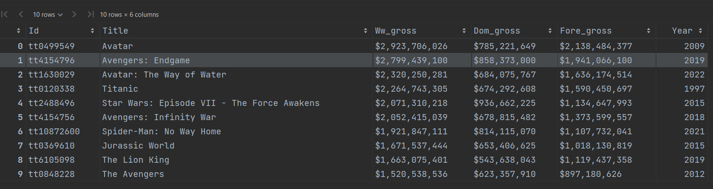
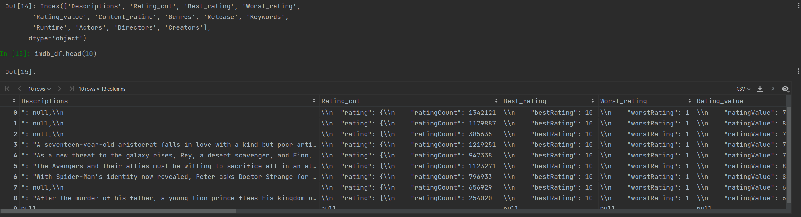
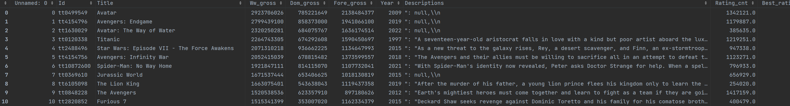
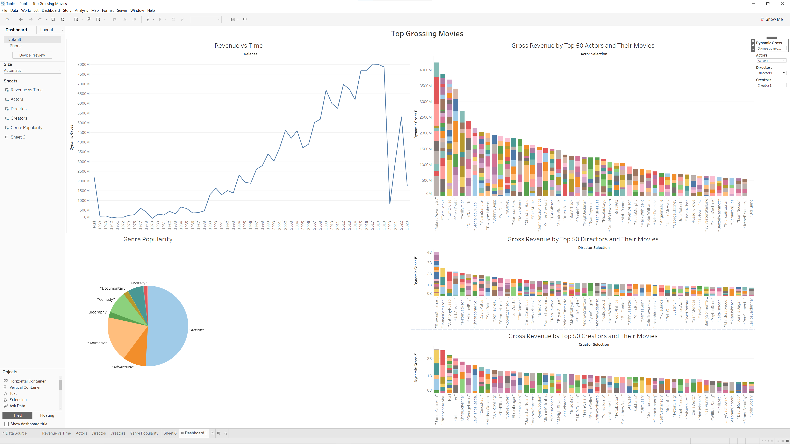
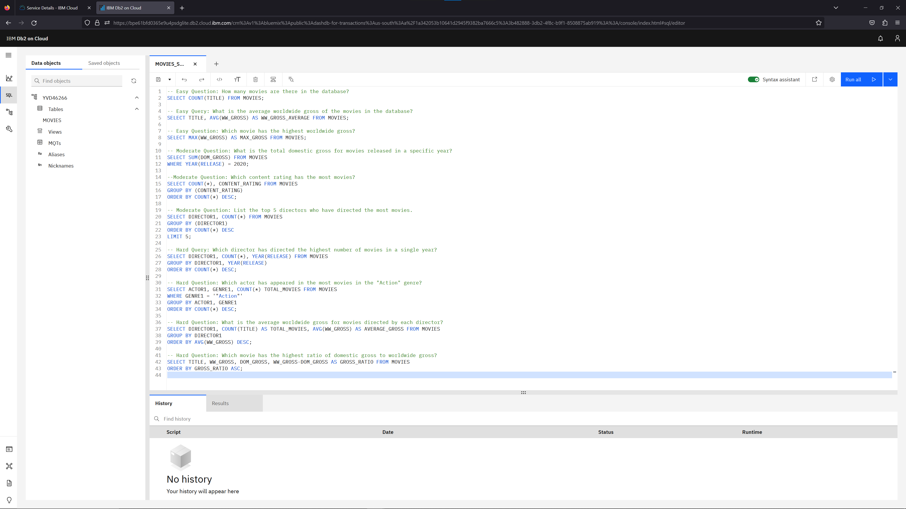

# Worldwide Top Grossing Movies

## Overview
The purpose of this project is to collect and analyze data on the top 1000 grossing movies of all time. This project aims to demonstrate and practice data collection utilzing two data collection techniques: web-scraping with the Beautiful Soup package and PyMovieDb, an IMDB API. By scraping data from Box Office Mojo I collected the movie titles and their corresponding gross revenues both domestic and foreign. Aditionally I used the PyMovieDb API to gather futher information on the movies such as descriptions, ratings, keywords and film crew. The collected data was then organized in dataframes using Pandas and the data cleaning and formatting process began. Exploritory Data Analysis was conducted using Tableau to gain insights into the dataset and dashboard was built to visualize the descriptive statistics. Finally, I loaded the cleaned dataframe into an IBM Db2 database for SQL testing and practice.

## Motivation
The motivation for this project was my passion for film and it's art. I also wanted to gain insights into the highest selling movies of all time and understand the various aspects related to their success, by analyzing data to identify any patterns, trends or interesting observations about these movies. Additionally, this project provided the perfect opportunity to apply a multitude of techniques and skills involving data collection, cleaning, EDA and visualization, as well as working with databases. 

## Data Collection and Cleaning
### Web-Scraping with Beautiful Soup
I utilized web-scraping techniques with Beautiful Soup a popular python package for parsing html. The Data extracted was from (boxofficemojo.com). Specifically I scraped the top 1000 grossing movie Id's, Titles, and their respective Gross Earnings from three categories: Worldwide Gross Earnings, Domestic Gross Earnings, and Foreign Gross Earnings. The collected data was stored in a dataframe to be joined later. 

### PyMovieDB
To gather additional information about the top grossing movies, I made use of the PyMovieDb API. Using the Id's of the movies collected from BoxOfficeMojo I was able to retrieve deatials from IMDB such as Descriptions, Ratings, Keywords, Genres and Film Crew. This provided a more detailed dataset on each movie.

### Data Processing and Cleaning
The collected data was organized and cleaned using the Pandas library in Python. The cleaning process involved handling missing values, removing duplicates and standardizing formats.
* Gross Earnings - Converted into numeric values.
* Ratings - Converted into numeric values.
* Genres - Removed unnecessary string values and seperated into 3 seperate values.
* Release - Removed unnecessary string values and converted into Datetime format.
* Keywords - Removed unnecessary string values.
* Runtime - Removed unnecessary string values. 
* Actors - Removed unnecessary string values and seperated into 3 seperate values.
* Directors - Removed unnecessary string values and seperated into 3 seperate values.
* Creators - Removed unnecessary string values and seperated into 3 seperate values.

## Exploritory Data Analysis (EDA) with Tableau
To visually represent the insights gained from the data analysis, I built a dashboard using Tableau. The dashboard incorperated dynamic visualizations such as barcharts, line graphs and pie charts comparing the Gross Earnings of movies to multiple different variables such as release dates, genres, actors, directors and creators. These visual representations provide an intuitive way to interpret the data and communicate the results effectively. 

## IBM Database Integration
To exercise my SQL skills, I loaded the cleaned and processed data into an IBM Db2 Database. This step involved connecting to the database and creating a table to store the movie data. By loading the dataset into a database I gained fresh experience in working with SQL queries, performing data retrieval, and manipulation tasks. To asses and evaluate the data I utilzed ChatGPT-4 to create a sample of test queries that can be seen below.

## Code and Resource Reference
Python Verson: 3.9

Packages: Pandas, BeautifulSoup, requests, PyMovieDb

Credit: itsmehermant7 creator of PyMovieDb

Gross Earnings Data: (https://www.boxofficemojo.com/chart/ww_top_lifetime_gross/?area=XWW&offset=0)

Tableau Dashboard: (https://public.tableau.com/app/profile/homero.garza/viz/TopGrossingMovies_16863315033850/Dashboard1)

## Conclusion, Thoughts and Considerations
Through this project I achieved the following:
* Successfully collected data on the top 1000 grossing movies of all time.
* Demonstrated proficiency in web scraping techniques using Beautiful Soup and data collection with PyMovieDb.
* Created a dataframe using Pandas and performed necessary data cleaning and formatting.
* Conducted Exploratory Data Analysis (EDA) to gain insights into the dataset.
* Built a dashboard with Tableau to visualize descriptive statistics and provide a user-friendly interface.
* Loaded the cleaned data into IBM Db2 for SQL integration and evaluation with a database managment system.

During this project I learned valuable lessons and considerations:
* Web scraping can be a powerful tool for data collection, but it is essential to understand a websites terms and services to adhere to ethical scraping practices.
* The PyMovieDb API provided a convenient way to access additional movie information, expanding the scope of the dataset.
* Data cleaning and formatting are critical steps to ensure accuracy and usability of the data.
* EDA enabled me to discover patterns, trends and outliers.
* Building a dashboard enhanced data visualization and allowed for effective communication of insights across movies and gross earnings.
* Integration with a database management system provides opportunities for SQL testing and scalability of data storage. 

Overall, this project has provided valuable hands-on experience in data collection, data cleaning, exploratory data analysis, visualizations and databases. It has also offered insight into an industry that I have a deep passion for, giving me a deeper understanding on what goes into the commercial success.

